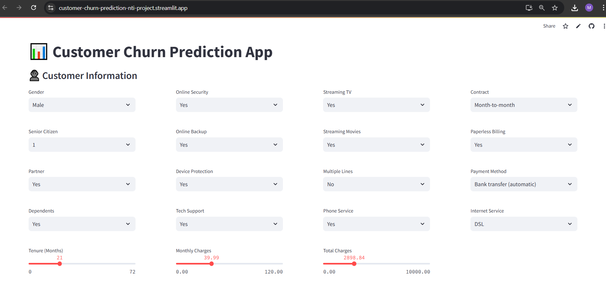

# Customer-Churn-Prediction
A machine learning web app that predicts whether a telecom customer is likely to churn (leave the service) based on their personal and service-related features. Built using Scikit-learn, Streamlit, and trained on the popular Telco Customer Churn dataset.

## 🛠️ Tools & Technologies Used
Python
Libraries:
  - pandas
  - scikit-learn
  - imbalanced-learn
  - streamlit
  - joblib
  
## 🔍 Pipeline Diagram
- Raw Data
     ↓
- ColumnTransformer
   - Binary Encoding (Yes/No, Gender)
   - OneHot Encoding (Contract, Payment Method, etc.)
   - Standard Scaling (Tenure, Monthly Charges, etc.)
     ↓
- SMOTEENN (Balancing)
     ↓
- Classifier (SVM / Logistic / KNN)
     ↓
- Prediction

## ⚙️ Data Preprocessing Pipeline
A preprocessing pipeline was built using ColumnTransformer, including:

1 - Binary Encoding for yes/no and gender columns
2 - One-Hot Encoding for categorical variables
3 - Standard Scaling for numerical features
4 - SMOTEENN to handle class imbalance

## 🤖 Models Trained
Logistic Regression
Support Vector Machine (SVM)
K-Nearest Neighbors (KNN)
Each model was integrated into a pipeline including preprocessing and SMOTEENN, then trained and evaluated

# 🧪 Model Evaluation Results
### 🔹 Logistic Regression
  - Accuracy: 0.736
  - Precision: 0.503
  - Recall: 0.854
  - F1 Score: 0.627

### 🔹 SVM (Best Performing Model)
  - Accuracy: 0.758
  - Precision: 0.518
  - Recall: 0.871
  - F1 Score: 0.648

### 🔹 KNN
  - Accuracy: 0.721
  - Precision: 0.482
  - Recall: 0.883
  - F1 Score: 0.615

## Conclusion
The SVM model showed the best overall performance with a good balance between precision and recall. It was selected as the final model for deployment.

## 🚀 Deployment
The project was deployed using Streamlit, allowing users to interact with the trained model through a simple web interface.

